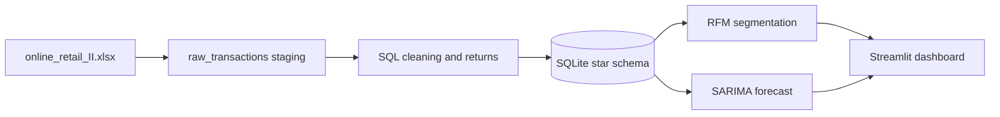

# ChurnCarts

End-to-end e-commerce analytics platform for the **Online Retail II** UK gift-ware retailer dataset (December 2009–December 2011, 1.07M raw rows). It combines SQLite SQL ETL, Python RFM segmentation, SARIMA forecasting, and a Streamlit dashboard.

## Architecture



## Project structure

- `data/online_retail_II.xlsx` — supplied source workbook; generated `churncarts.db` is created locally.
- `sql/01_schema.sql` and `sql/02_transform.sql` — reproducible DDL and transformations.
- `src/etl.py` — workbook loader, SQL orchestrator, row counts and data-quality log.
- `src/rfm.py` — SQL customer aggregates, quintile scoring, segment rules and churn-risk flag.
- `src/forecast.py` — monthly series, ADF/KPSS, SARIMA grid, holdout metrics, forecast intervals and diagnostics.
- `app.py` — Streamlit navigation: Overview, Customer Segments, Sales Forecast, Data Pipeline.
- `notebooks/EDA.ipynb` — starter exploratory notebook.
- `artifacts/` — generated CSV/JSON outputs.

## Setup and run

```bash
cd ChurnCarts
python -m venv .venv
source .venv/bin/activate
pip install -r requirements.txt
python run_etl.py
streamlit run app.py
```

Open the displayed local URL. The app expects `data/churncarts.db` and generated files under `artifacts/`; rerun `python run_etl.py` after replacing the workbook. For Streamlit Community Cloud, push this folder to a GitHub repository, set the main file to `app.py`, and add `requirements.txt`; the first run should execute `python run_etl.py` once during deployment or use a pre-generated database/artifacts committed to the repository.

## Assumptions and implementation notes

1. SQLite is the default to make the project runnable without a database server; the SQL is portable with minor date-function changes for PostgreSQL.
2. Non-product codes include `POST`, `D`, `M`, `BANK CHARGES`, `C2*`, and `DOT*`; cancellation invoices beginning with `C` are moved to `returns` before positive-sales filtering.
3. Duplicate lines are deduplicated on all raw business columns. Null customer IDs are removed before customer analytics.
4. RFM recency is days since last purchase versus the maximum observed purchase date + 1. Frequency is distinct invoices and Monetary is gross positive-line revenue. Quintiles score Recency inversely and Frequency/Monetary positively.
5. Monthly SARIMA is selected from a compact AIC grid with yearly seasonality `s=12`; the last 15% is held out and compared with a seasonal-naive baseline.
6. Confidence intervals are model-based 95% intervals, not a guarantee of realized outcomes.

## Findings

After running the pipeline, see `artifacts/rfm_segments.csv`, `artifacts/forecast_metrics.json`, and the dashboard. The generated summary is data-dependent and deliberately not hard-coded into this README.

## Screenshots

Run the dashboard and capture screenshots for your deployment README. The dashboard is designed for a wide layout with KPI cards, Plotly trend charts, segment views, forecast bands, and pipeline checks.

## Resume bullets

- Built an end-to-end e-commerce analytics platform using SQLite SQL ETL, Python, Streamlit, Plotly, and SARIMA on 1.07M Online Retail II transactions.
- Designed a star schema with fact sales, customer/product/date dimensions, returns handling, duplicate/null cleansing, revenue views, and row-count/data-quality observability.
- Created quintile-based RFM segmentation and a 90-day churn-risk flag, exposing segment revenue share and customer-level at-risk exports.
- Implemented monthly SARIMA model selection with ADF/KPSS tests, holdout MAE/RMSE/MAPE versus seasonal-naive, confidence intervals, and residual diagnostics.
